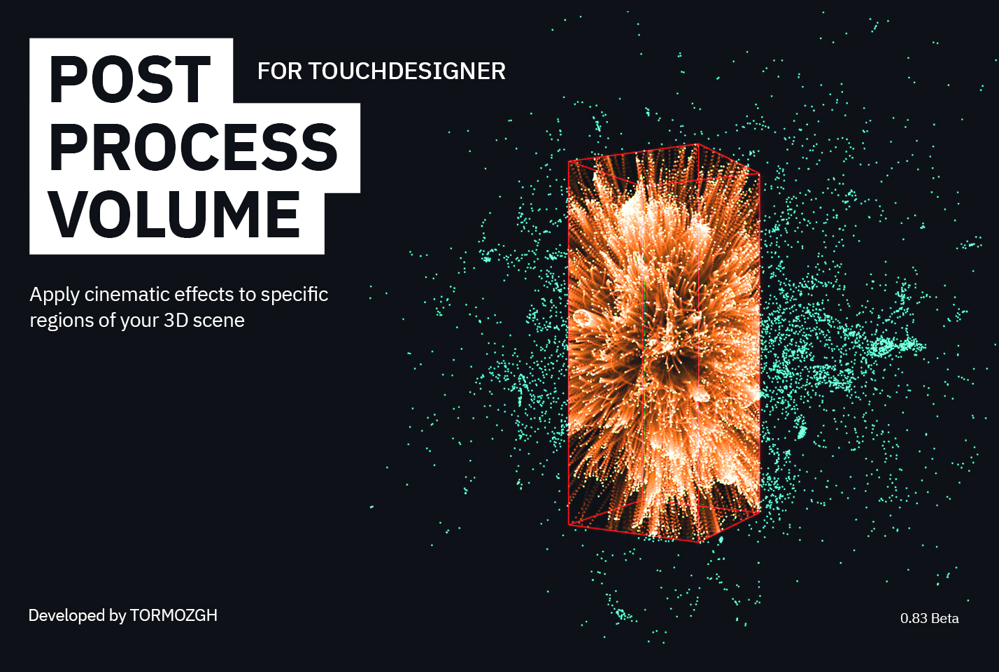
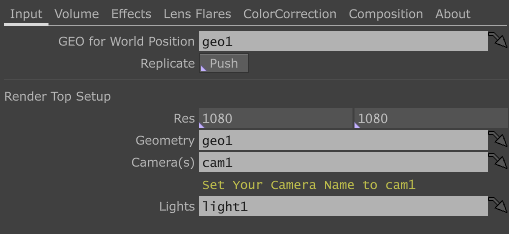
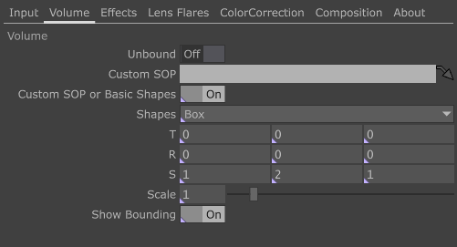
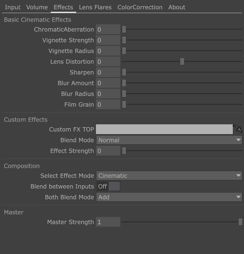
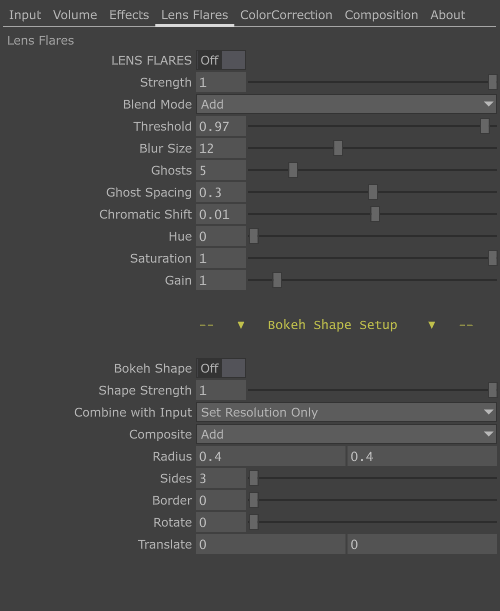
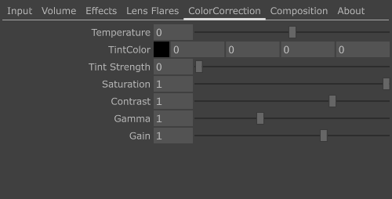

# 🎨 Post Process Volume for TouchDesigner

A custom TouchDesigner tool that allows you to apply visual effects to a defined region of your 3D environment.

You can use either the built-in cinematic effects or your own custom effects.  

Inspired by [Unreal Engine](https://www.unrealengine.com/en-US)’s Post Process Volume, this component brings a similar workflow into TouchDesigner.✨  

- Developed by [TORMOZGH](www.instagram.com/tormozgh)  
- Version: 0.64 Beta (Released Sep 2025)

---

## 🚀 How to Use

### 1. Download the Component
Get the latest release from the [Releases](../../releases) section.  

> ⚠️ This component is currently in **Beta** and works with **TouchDesigner 2022.24200 or newer**.  
Older versions are not recommended. If you try it on an older version and it works, please let me know! 🙏  

---

### 2. What’s Inside
The release package contains:  

- **PostProcessVolume_Sample_Project** (`.toe`)  
- **PostProcessVolume** (`.tox`)  

---

### 3. Explore the Sample Project
Open the `.toe` file to see the component in action.  
The sample project demonstrates all features and shows how to connect the component to your scene.  

---

### 4. Add the Component to Your Own Project
Drag the `.tox` file into your TouchDesigner project.  

---

## 🛠 Input Tab
This tab sets up the initial connection between your 3D scene and the component.  

  

- **GEO for World Position**:  
  The component uses *World Position* data extensively. Assign your main geometry here.  
  - If the geometry has an input, connect it to the component’s SOP input.  
  - If it’s self-contained, no input is needed.  
- **Replicate**:  
  Recreates the World Position setup if needed.  

**Render TOP Setup**  
Configure the rendering pipeline for your scene:  
- **Res**: Overall resolution of the component (matches your 3D environment).  
- **Geometry**: Main geometry of the scene.  
- **Camera**: Primary camera (must be named **`cam1`**).  
- **Light**: Main scene light.  

---

## 🌐 Volume Tab
Define the 3D region (volume) where effects are applied.  

  

- **Unbound**: Apply the effect to the entire 3D scene.  
- **Custom SOP**: Assign your own SOP as the volume.  
- **Custom SOP or Basic Shapes**: Switch between default shapes or your SOP.  
- **Shapes**: Default shapes: **Box**, **Sphere**, **Torus**.  

  > 🔧 Tip: Edit shapes manually inside the component under the Volume section if needed.  

- **T (Translate)**: Move the volume.  
- **R (Rotate)**: Rotate the volume.  
- **S (Scale)**: Scale along individual axes.  
- **Uniform Scale**: Scale uniformly.  
- **Show Bounding Volume**: Display the volume bounds.  

---

## 🎬 Effects Tab
Apply and customize effects within your volume.  

  

> ℹ️ Custom effects are applied in 3D space using **Depth Map** and **World Position** data.  

**Basic Cinematic Effects**  
- Chromatic Aberration  
- Vignette  
- Lens Distortion  
- Sharpen  
- Blur  
- Film Grain  

**Custom Effects**  
- **Custom FX TOP**: Drop your custom TOP here.  
- **Blend Mode**: *Normal*, *Add*, *Multiply*, *Overlay*, *Screen*.  
- **Effect Strength**: Adjust the intensity of your custom effect.  

**Composition**  
Choose which effects to apply:  
- **Select Effect Mode**: *Cinematic*, *Custom*, or *Both*.  
- **Both Blend Mode**: Blend mode used when both effects are combined.  

- **Master Strength**: Controls the overall intensity of all active effects.  

---

## 💥 Lens Flares Tab
Control a custom-designed lens flare effect.  

  

> ⚠️ This effect applies to the **entire scene**, not the volume.

> ℹ️ Unlike a physically accurate lens flare, this implementation uses bright points in the image instead of actual light sources. As a result, it may not always produce exact results but it can create very cool visual effects 😉. Future updates will improve accuracy. 

**Lens Flares Controls**  
- Lens Flares: On/Off  
- Strength: Overall intensity of the lens flare
- Blend Mode: Scene blending  
- Threshold: Sets the brightness threshold used to detect highlights.  
- Blur Size: Flare blur  
- Ghosts: Number of rings  
- Ghost Spacing: Ring spacing  
- Chromatic Shift: RGB shift  
- Hue/Sat/Gain: Adjust color parameters  

**Bokeh Shape Setup**  
- Bokeh Shape: Enable/disable custom bokeh  
- Shape Strength: Intensity  
- Combine with Input:
     - *Set Resolution Only*: Display only the custom bokeh shape.  
     - *Composite and Set Resolution*: Combine the custom bokeh with the main bokeh.  
- Composite: Blend mode for bokeh shapes  
- Radius: Shape radius  
- Sides: Number of sides  
- Border: Outline thickness  
- Rotate: Rotate shape  
- Translate: Move shape  

---

## 🎨 Color Correction Tab
Enhance the final look by adjusting color parameters.  

  

> ℹ️ Color correction affects only the defined **volume**.  

**Controls**  
- Temperature: Warmth/coolness  
- Tint Color & Strength: Tint adjustments  
- Saturation: Color saturation  
- Contrast: Contrast level  
- Gamma: Midtone brightness  
- Gain: Overall brightness  

