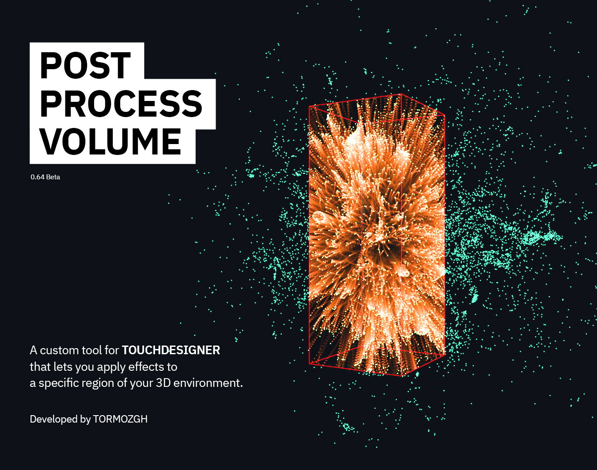

# 🎨 Post Process Volume for TouchDesigner

A custom tool for [TouchDesigner](https://derivative.ca) that lets you apply effects to a specific region of your 3D environment.

These effects can be either the built-in cinematic presets included in the component, or custom effects you provide as an input.

The component is inspired by [Unreal Engine](https://www.unrealengine.com/en-US)’s Post Process Volume, bringing a similar workflow into Touchdesigner.✨  

- Developed by [TORMOZGH](www.instagram.com/tormozgh)

- Version: 0.64 Beta (Released on Sep 2025)

---

## ✨ Usage
